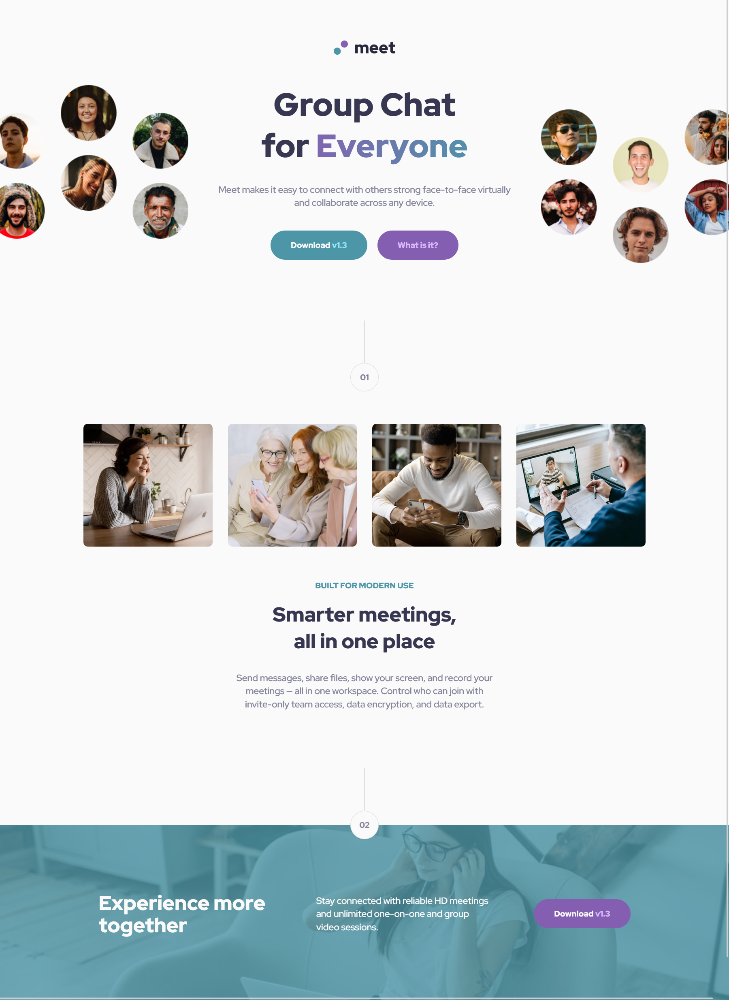

# Frontend Mentor - Meet landing page solution!

This is a solution to the [Meet landing page challenge on Frontend Mentor](https://www.frontendmentor.io/challenges/meet-landing-page-rbTDS6OUR). Frontend Mentor challenges help you improve your coding skills by building realistic projects. 

## Table of contents

- [Overview](#overview)
  - [The challenge](#the-challenge)
  - [Screenshot](#screenshot)
  - [Links](#links)
- [My process](#my-process)
  - [Built with](#built-with)
  - [What I learned](#what-i-learned)
  - [Useful resources](#useful-resources)
- [Author](#author)

### Screenshot

### Links

- Solution URL: [Frontend Mentor Solution]()
- Live Site URL: [Live Site at Vercel]()
## My process

### Built with

- Semantic HTML5 markup
- Grid
- Responsive Design

### What I learned

fill it

## Author
- Github - 
- Frontend Mentor - 
